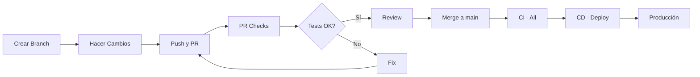

# Configuración de CI/CD con GitHub Actions

Este documento describe la configuración completa de CI/CD implementada para el proyecto Release Planner.

## 🚀 Resumen

Se ha implementado un sistema completo de CI/CD con GitHub Actions que incluye:

- ✅ **CI Automático**: Tests y builds en cada PR y push
- ✅ **CD Automático**: Despliegue automático a producción
- ✅ **Optimización**: Solo ejecuta tests para archivos cambiados
- ✅ **Caché**: Acelera builds con caché de dependencias
- ✅ **Múltiples Estrategias**: Kubernetes y Docker Compose
- ✅ **Container Registry**: Imágenes Docker en GitHub Container Registry

## 📋 Workflows Implementados

### 1. CI - API (`ci-api.yml`)
Ejecuta tests y build de la API cuando hay cambios en `apps/api/`.

**Características:**
- Tests con PostgreSQL y Redis como servicios
- Linter antes de tests
- Build y guardado de artefactos
- Coverage report a Codecov

### 2. CI - Portal (`ci-portal.yml`)
Ejecuta tests y build del Portal cuando hay cambios en `apps/portal/`.

**Características:**
- Tests con Vitest
- Linter antes de tests
- Build con variables de entorno
- Coverage report a Codecov

### 3. CI - All (`ci-all.yml`)
Ejecuta tests y build de todas las aplicaciones.

**Características:**
- Tests paralelos de API y Portal
- Linter de todas las aplicaciones
- Build completo
- Artefactos para ambas aplicaciones

### 4. PR Checks (`pr-checks.yml`)
Ejecuta checks inteligentes solo para archivos cambiados.

**Características:**
- Detección automática de cambios
- Solo ejecuta tests relevantes
- Optimiza tiempo de ejecución
- Linter solo para archivos modificados

### 5. CD - Deploy (`cd-deploy.yml`)
Despliegue automático con Docker y Kubernetes.

**Características:**
- Build y push de imágenes Docker
- Despliegue a staging (develop)
- Despliegue a producción (main)
- Soporte para Kubernetes y Docker Compose

### 6. CD - Simple Deploy (`cd-simple.yml`)
Despliegue simple vía SSH.

**Características:**
- Despliegue vía SSH
- Descarga de artefactos
- Personalizable para diferentes servidores

## ⚙️ Configuración Inicial

### Paso 1: Configurar Secrets

Ve a tu repositorio en GitHub:
1. Settings → Secrets and variables → Actions
2. Agrega los siguientes secrets:

#### Secrets Requeridos para CD

**Para Kubernetes:**
```
KUBECONFIG_STAGING=<tu-kubeconfig-staging>
KUBECONFIG_PRODUCTION=<tu-kubeconfig-production>
KUBERNETES_ENABLED=true
```

**Para SSH (Simple Deploy):**
```
SSH_PRIVATE_KEY=<tu-clave-privada-ssh>
DEPLOY_HOST=<tu-servidor.com>
DEPLOY_USER=<usuario-ssh>
DOCKER_COMPOSE_ENABLED=true
```

**Opcional:**
```
VITE_API_URL=https://api.tudominio.com/api
STAGING_URL=https://staging.tudominio.com
PRODUCTION_URL=https://tudominio.com
```

### Paso 2: Configurar Branch Protection

1. Ve a Settings → Branches
2. Agrega regla para `main`:
   - ✅ Require a pull request before merging
   - ✅ Require status checks to pass before merging
   - ✅ Require branches to be up to date before merging
   - Selecciona: `CI - All` como required check

### Paso 3: Configurar Environments (Opcional)

1. Ve a Settings → Environments
2. Crea environments:
   - `staging`
   - `production`
3. Configura URLs y secrets específicos por ambiente

## 🔄 Flujo de Trabajo

### Desarrollo Normal



### Flujo Detallado

1. **Desarrollador crea branch:**
   ```bash
   git checkout -b feature/nueva-funcionalidad
   ```

2. **Hace cambios y commits:**
   ```bash
   git add .
   git commit -m "feat: nueva funcionalidad"
   git push origin feature/nueva-funcionalidad
   ```

3. **Crea Pull Request:**
   - GitHub detecta cambios
   - `PR Checks` se ejecuta automáticamente
   - Solo ejecuta tests para archivos modificados

4. **Review y Merge:**
   - Revisar cambios
   - Verificar que tests pasen
   - Merge a `main`

5. **Despliegue Automático:**
   - `CI - All` ejecuta todos los tests
   - `CD - Deploy` construye imágenes Docker
   - Despliega a producción automáticamente

## 📊 Monitoreo

### Ver Estado de Workflows

1. Ve a la pestaña **Actions** en GitHub
2. Selecciona el workflow que quieres ver
3. Revisa logs y resultados

### Badges de Estado

Agrega estos badges a tu README:

```markdown


```

## 🐛 Troubleshooting

### Tests Fallan

**Problema:** Tests fallan en CI pero pasan localmente

**Solución:**
1. Verificar que servicios (PostgreSQL, Redis) estén configurados
2. Verificar variables de entorno
3. Revisar logs en GitHub Actions
4. Ejecutar tests localmente con las mismas variables:
   ```bash
   DATABASE_HOST=localhost DATABASE_PORT=5432 npm run test:api
   ```

### Build Fallan

**Problema:** Build falla en CI

**Solución:**
1. Verificar que todas las dependencias estén en `package.json`
2. Verificar que no haya errores de TypeScript
3. Revisar logs de build
4. Ejecutar build localmente:
   ```bash
   npm run build:api
   npm run build:portal
   ```

### Deploy Fallan

**Problema:** Despliegue falla

**Solución:**
1. Verificar que secrets estén configurados correctamente
2. Verificar acceso a Kubernetes/SSH
3. Verificar permisos de GitHub Actions
4. Revisar logs de despliegue

### Imágenes Docker No se Publican

**Problema:** Las imágenes no se publican en GitHub Container Registry

**Solución:**
1. Verificar que `GITHUB_TOKEN` tenga permisos
2. Verificar que el repositorio tenga permisos de escritura
3. Verificar formato del nombre de la imagen

## 🎯 Optimizaciones Implementadas

### 1. Caché de Dependencias
- npm cache para instalaciones rápidas
- Docker Buildx cache para builds rápidos

### 2. Ejecución Condicional
- Solo ejecuta cuando hay cambios relevantes
- PR Checks solo ejecuta tests para archivos modificados

### 3. Paralelización
- Tests de API y Portal en paralelo
- Builds después de tests exitosos

### 4. Artefactos
- Guarda builds para uso posterior
- Retención de 7 días

## 📈 Métricas y Mejoras

### Tiempos de Ejecución Esperados

- **CI - API**: ~5-10 minutos
- **CI - Portal**: ~3-5 minutos
- **CI - All**: ~8-15 minutos
- **CD - Deploy**: ~10-20 minutos

### Mejoras Futuras

1. **Tests E2E**: Agregar tests end-to-end
2. **Performance Tests**: Agregar tests de performance
3. **Security Scanning**: Escaneo de vulnerabilidades
4. **Dependency Updates**: Actualización automática de dependencias
5. **Notifications**: Integración con Slack/Discord
6. **Rollback**: Rollback automático en caso de fallos

## 🔐 Seguridad

### Best Practices Implementadas

1. ✅ Secrets encriptados
2. ✅ Permisos mínimos necesarios
3. ✅ No exposición de credenciales en logs
4. ✅ Branch protection
5. ✅ Require reviews antes de merge

### Recomendaciones Adicionales

1. Rotar secrets regularmente
2. Usar environments para diferentes entornos
3. Revisar logs regularmente
4. Mantener dependencias actualizadas
5. Usar Dependabot para actualizaciones automáticas

## 📚 Recursos

- [GitHub Actions Documentation](https://docs.github.com/en/actions)
- [Docker Buildx](https://docs.docker.com/buildx/)
- [Helm Documentation](https://helm.sh/docs/)
- [Kubernetes Documentation](https://kubernetes.io/docs/)

## ✅ Checklist de Configuración

- [ ] Secrets configurados en GitHub
- [ ] Branch protection configurado
- [ ] Environments configurados (opcional)
- [ ] Primera ejecución exitosa de CI
- [ ] Primera ejecución exitosa de CD
- [ ] Badges agregados al README
- [ ] Documentación actualizada

## 🎉 Conclusión

El sistema de CI/CD está completamente configurado y listo para usar. Los workflows se ejecutarán automáticamente en cada PR y push, asegurando que:

- ✅ Todos los tests pasen antes de merge
- ✅ El código esté libre de errores de linting
- ✅ Los builds sean exitosos
- ✅ El despliegue sea automático y confiable

¡Tu pipeline de CI/CD está listo para agilizar tus cambios! 🚀

